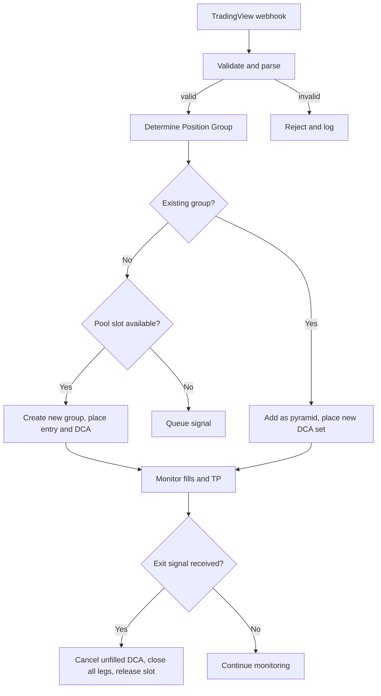
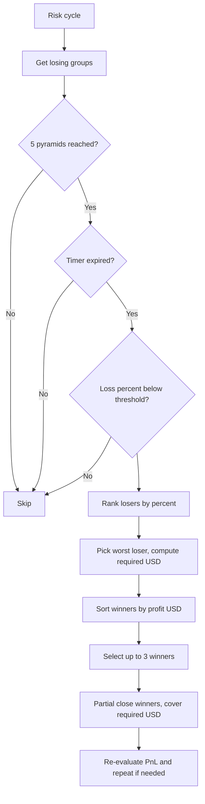
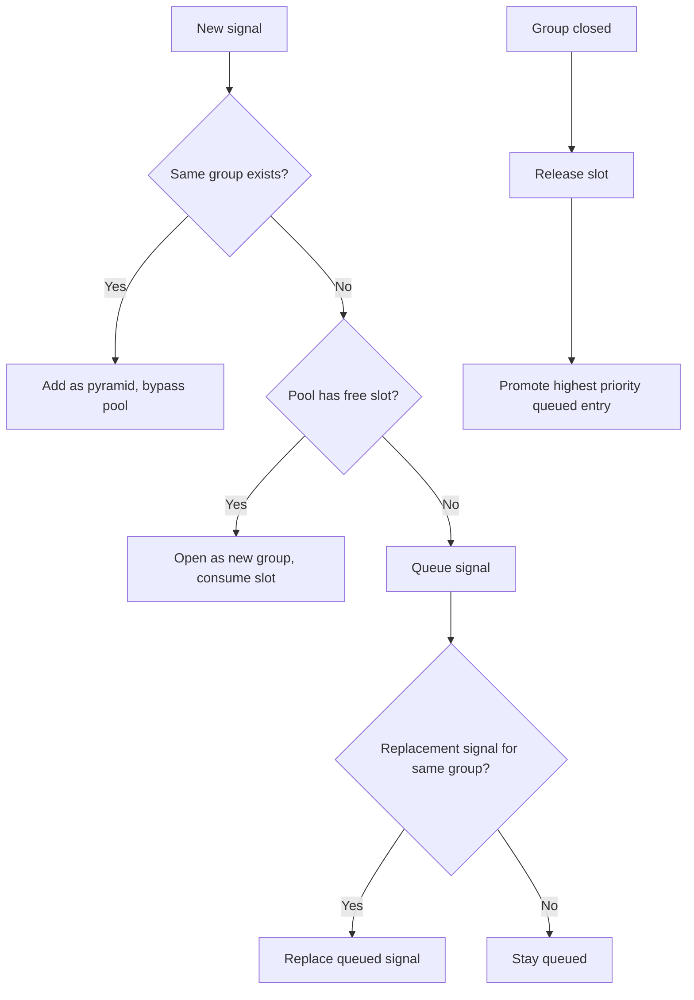

# Execution Engine Scope of Work

The Execution Engine is a fully automated trading system that:

- Receives TradingView webhook signals
- Executes grid-based entries using pyramids received by TradingView and DCA inside the engine
- Applies precision validation before every order
- Automatically handles exits
- Runs a Risk Engine to offset losing trades
- Enforces max position limits using a pool + queue
- Stores all data in database
- Includes an integrated web app for real-time monitoring

## Key Characteristics

- Supports multiple exchanges and symbols
- All logic lives inside a single webapp (FastAPI backend + React frontend)
- TradingView **only triggers the entry** (and optionally the exit)
- The engine itself calculates and executes all **DCA orders**
- The engine itself handles all **pyramid scaling**
- The engine itself runs the **Risk Engine**, without needing TradingView
- **_TradingView is only used to start or end a position. All DCA, pyramid scaling, take-profit, and risk logic are handled by the engine and do not require additional TradingView alerts._**

### Example to clarify

If TradingView fires this webhook:

| Key / JSON Path | Example Value | Source / Placeholder | Description |
|-----------------|---------------|----------------------|-------------|
| secret | YOUR_WEBHOOK_SECRET | Manual | Security key to verify request |
| source | tradingview | Static | Identifies webhook origin |
| timestamp | {{timenow}} | TradingView | Alert execution timestamp |
| tv.exchange | BINANCE | {{exchange}} | Exchange name from TradingView |
| tv.symbol | BTCUSDT | {{ticker}} | Trading pair |
| tv.timeframe | 15 | {{interval}} | Chart timeframe in minutes |
| tv.action | buy | {{strategy.order.action}} | Buy, Sell, Long, Short |
| tv.market_position | long | {{strategy.market_position}} | Current strategy position |
| tv.market_position_size | 2.5 | {{strategy.market_position_size}} | Current position size |
| tv.prev_market_position | flat | {{strategy.prev_market_position}} | Previous position |
| tv.prev_market_position_size | 0 | {{strategy.prev_market_position_size}} | Previous size |
| tv.entry_price | {{strategy.order.price}} | TradingView | Order execution price |
| tv.close_price | {{close}} | TradingView | Last candle close |
| tv.order_size | {{strategy.order.contracts}} | TradingView | Order size (contracts/units) |
| strategy_info.trade_id | 12345 | {{strategy.order.id}} | Unique order ID |
| strategy_info.alert_name | BTC Long Entry | {{alert_name}} | Name of the alert |
| strategy_info.alert_message | DCA Entry 1 | {{strategy.order.comment}} | Custom alert message/comment |
| execution_intent.type | signal | Manual | signal, exit, reduce, reverse |
| execution_intent.side | buy | Mirrors tv.action | Direction of trade |
| execution_intent.position_size_type | contracts | Manual | contracts, base, quote |
| execution_intent.precision_mode | auto | Manual | Auto-detect precision or force rules |
| risk.stop_loss | {{strategy.position_avg_price}} | Optional | Stop loss reference |
| risk.take_profit | null | Optional | Take profit reference |
| risk.max_slippage_percent | 0.2 | Manual | Allowed slippage percent |

The engine will:
1. Open Position Group
2. Submit pyramid + DCA orders by itself
3. Calculate TP levels automatically
4. Handle partial TP close when triggered
5. Run Risk Engine if losses exceed threshold
6. Close full position if exit webhook arrives
7. **Continue working even if no more TradingView signals arrive**

Designed for stable, repeatable, hands-off execution.

---

## 2.1 Purpose

- Execute entries that received from TradingView in different price level and execute take profit based on the grid configuration
- Improve price efficiency by using multiple DCA which will reduce drawdown using DCA layering
- Allow different take-profit modes depending on grid configuration

## 2.2 Core Logic

- First signal creates a new Position Group (refer to Appendix table on 15 for full definition)
- Additional long signals (same pair + timeframe) create pyramids, not new positions
- Each pyramid contains multiple DCA layers below the base price
- Each layer has 3 elements:
  1. Price gap
  2. Weight allocation
  3. Take-profit target

### 2.2.1 Pyramid Indexing

Pyramids use a **zero-based index** to identify each entry within a Position Group:

| Pyramid Index | Description | DCA Configuration Source |
|---------------|-------------|--------------------------|
| 0 | Initial entry (first signal) | Default `levels` from DCA config |
| 1 | First pyramid continuation | `pyramid_specific_levels["1"]` if defined, else default `levels` |
| 2 | Second pyramid continuation | `pyramid_specific_levels["2"]` if defined, else default `levels` |
| ... | ... | ... |
| N | Nth pyramid continuation | `pyramid_specific_levels["N"]` if defined, else default `levels` |

**Key Points:**

- `pyramid_count` in the Position Group tracks how many pyramids have been added (starts at 0)
- After initial entry: `pyramid_count = 0`
- After first pyramid: `pyramid_count = 1`
- The `max_pyramids` config (default 5) limits total pyramids including initial entry
- Each pyramid's DCA prices are calculated from **that pyramid's entry price**, not the original base entry

**Pyramid-Specific DCA Configuration:**

You can define different DCA levels for each pyramid using `pyramid_specific_levels`:

```json
{
  "levels": [...],  // Default DCA levels (used for pyramid_index=0 and any undefined index)
  "pyramid_specific_levels": {
    "1": [...],  // Custom DCA levels for first pyramid continuation
    "2": [...],  // Custom DCA levels for second pyramid continuation
    "3": [...]   // Custom DCA levels for third pyramid continuation
  }
}
```

### Execution rules:

✅ First TP or exit signal always wins  
✅ Unfilled DCA orders are cancelled on exit  
✅ Different take-profit modes available

## 2.3 DCA Example Table (Long Entry)

| DCA Layer | Price Gap | Capital Weight | Take Profit |
|-----------|-----------|----------------|-------------|
| DCA0 | 0 percent | 20 percent | 1 percent |
| DCA1 | -0.5 percent | 20 percent | 0.5 percent |
| DCA2 | -1.0 percent | 20 percent | 2 percent |
| DCA3 | -1.5 percent | 20 percent | 1.5 percent |
| DCA4 | -2.0 percent | 20 percent | 1 percent |

📌 Each TP is calculated from actual fill price, not original entry price.

## 2.4 Take-Profit Modes

| Mode | Description |
|------|-------------|
| Per-Leg TP | Each DCA closes independently based on its own TP |
| Aggregate TP | Entire position closes when avg entry reaches TP |
| Hybrid TP | Both logics run, whichever closes first applies |
| Pyramid Aggregate TP | Weighted average across all pyramids, TP based on combined position |

## 2.5 Exit Logic

✅ If any TP is hit → only that segment closes  
✅ If TradingView exit arrives → full group closes instantly  
✅ Unfilled DCA is cancelled on exit  
✅ First trigger always wins

---

## 3. Precision Validation

Before any order is submitted, the engine fetches:

- Tick size (price decimal rule)
- Step size (quantity rule)
- Minimum quantity
- Minimum notional value

### Precision rules:

✅ Prices are rounded to valid tick size (ROUND_DOWN)
✅ Quantity rounded to valid step size (ROUND_DOWN)
✅ Orders below minimum notional are blocked
✅ If precision metadata is missing → configurable behavior (block or use fallback)

### 3.1 Precision Configuration

Configuration is in `RiskEngineConfig.precision`:

| Parameter | Description | Default |
|-----------|-------------|---------|
| `refresh_seconds` | How often to refresh precision data from exchange | 172800 (48 hours) |
| `block_on_missing_metadata` | Block orders when precision metadata unavailable | `true` |
| `fallback_rules.tick_size` | Fallback tick size when metadata missing | 0.00000001 |
| `fallback_rules.step_size` | Fallback step size when metadata missing | 0.000001 |
| `fallback_rules.min_qty` | Fallback minimum quantity | 0.000001 |
| `fallback_rules.min_notional` | Fallback minimum notional | 1 |

**Behavior Modes:**

| `block_on_missing_metadata` | Behavior |
|-----------------------------|----------|
| `true` (default) | Block signal, return error if precision data unavailable |
| `false` | Log warning and use `fallback_rules` to proceed |

### 3.2 Precision Data Caching

Precision rules are fetched in bulk from the exchange (all symbols at once) and cached:

- Cache TTL: Configurable via `precision.refresh_seconds`
- Stale/missing data triggers a fresh fetch
- Symbols stored both as CCXT format (`BTC/USDT`) and exchange ID (`BTCUSDT`)

### Result:

- Zero precision-based API rejection
- Universal exchange compatibility
- Works on Binance, Bybit, OKX, KuCoin, etc.
- Configurable fallback for edge cases

---

## 4. Risk Engine

The Risk Engine is responsible for closing losing positions using profits from winning positions. It activates only after full structure conditions are met and follows strict priority rules.

### 4.1 Objective

- Reduce floating losses without closing positions at full loss
- Use winning trades to offset losing trades
- Maintain controlled portfolio drawdown
- Execute offsets in **dollar value**, not percent

### 4.2 Activation Conditions

The Risk Engine will only start operating on a Position Group when all of the following are true:

✅ All 5 pyramids for that pair and timeframe have been received  
✅ Post-full waiting time has passed  
✅ Loss percent is below configured threshold  
✅ (Optional) Trade age threshold is met if enabled

### 4.3 Timer Behavior

The timer starts when a position reaches "pyramids complete" status (configurable via `required_pyramids_for_timer`). The timer duration is controlled by `post_pyramids_wait_minutes`.

| Timer Condition | Description |
|-----------------|-------------|
| Pyramids Complete | Timer starts when pyramid_count >= required_pyramids_for_timer AND all DCAs are filled |
| Timer Duration | Configurable via `post_pyramids_wait_minutes` (default 15 minutes) |
| Timer Expiry Check | Position becomes risk-eligible when current time > risk_timer_expires |

The `risk_timer_expires` field is set to: `current_time + post_pyramids_wait_minutes` when pyramids complete.

### 4.4 Selection Priorities

When the Risk Engine runs, it follows this ranking process:

1. Select the losing trade with the **highest loss percent**
2. If tied → select the one with highest unrealized dollar loss
3. If still tied → select the oldest trade

📌 Loss ranking = percent  
📌 Offset execution = USD

### 4.5 Offset Execution Logic

- required_usd = absolute unrealized loss of selected losing trade
- Select winning trades ranked by profit in USD
- Use up to 3 winning trades to cover required_usd
- Only close the portion needed to cover the loss
- Partial closes do **not** release pool slot
- Full Position Group closure **does** release pool slot

### 4.6 Risk Configuration Parameters

```
risk.loss_threshold_percent
risk.use_trade_age_filter
risk.age_threshold_minutes
risk.require_full_pyramids
risk.post_full_wait_minutes
risk.timer_start_condition
risk.reset_timer_on_replacement
risk.max_winners_to_combine
risk.partial_close_enabled
risk.min_close_notional
risk.max_slippage_percent
risk.slippage_action
```

### 4.7 Slippage Protection

Market orders (used for aggregate TP, exit signals, and risk engine closes) include slippage protection.

**Configuration** (in `RiskEngineConfig`):

| Parameter | Description | Default |
|-----------|-------------|---------|
| `max_slippage_percent` | Maximum acceptable slippage percentage | 1.0 (1%) |
| `slippage_action` | Action when slippage exceeds threshold | "warn" |

**Slippage Actions:**

| Action | Behavior |
|--------|----------|
| `warn` | Log warning, but execute order anyway (default, backward compatible) |
| `reject` | Raise `SlippageExceededError` after execution (caller can handle) |

**Note**: Slippage is calculated **post-execution** for market orders since market orders execute immediately. The system compares the expected price (fetched before order) against the actual fill price.

**Applied to:**

- Exit signals (via `handle_exit_signal`)
- Aggregate TP market closes
- Risk engine partial closes

---

## 5. Execution Pool

The Execution Pool limits how many Position Groups can be live at the same time.

📌 A Position Group = a unique user_id + symbol + exchange + timeframe + side
📌 Pyramids and DCA do not count as separate positions

### 5.1 Pool Rules

| Item | Counts Toward Max Limit? |
|------|--------------------------|
| First entry of new pair/timeframe | ✅ Yes |
| Pyramid entries | ❌ No (when `same_pair_timeframe` priority rule is enabled) |
| Pyramid entries (bypass disabled) | ⚠️ Competes for slot like new entries |
| DCA orders | ❌ No |
| Risk-engine partial close | ❌ No |
| Full Position Group closed | ✅ Slot released |

**Pyramid Pool Slot Behavior:**

The `same_pair_timeframe` priority rule controls whether pyramids bypass the execution pool limit:

| `same_pair_timeframe` Setting | Pyramid Behavior |
|-------------------------------|------------------|
| `true` (default) | Pyramids bypass pool limit and execute immediately |
| `false` | Pyramids must compete for available pool slots like new entries |

This is configured via `priority_rules.priority_rules_enabled.same_pair_timeframe` in the Risk Engine config.

### 5.2 Waiting Queue Rules

If the pool is full:

- New signals go into waiting queue
- If exit signal arrives while queued → it is deleted
- If a new pyramid signal arrives for same group → it **replaces** the queued one and replaced the entry price
- Replacement count is tracked internally
- Queue always ranked by selection priority

### 5.3 Queue Selection Priority

When a pool slot becomes free:

| Priority | Updated Rule | Explanation |
|----------|--------------|-------------|
| 1 | Same pair + same timeframe = auto-priority | If the queued signal is a continuation (pyramid) of an already active Position Group, it is selected first. When `same_pair_timeframe` rule is enabled, it bypasses the max position limit. |
| 2 | Pick the signal with the deepest current loss percentage | A larger loss percent means the market has moved further in discount zone, offering a better average entry. This follows a "buy deeper retrace first" logic. |
| 3 | If tied, choose the signal with the highest replacement count | A signal that was replaced multiple times by new alerts is considered repeatedly confirmed by the strategy, therefore higher priority. |
| 4 | If still tied, fall back to FIFO (first in, first out) | Oldest queued signal is selected last as a fair tiebreak rule. |

**Priority Rules Configuration:**

Each priority rule can be individually enabled/disabled via `priority_rules.priority_rules_enabled`:

```json
{
  "priority_rules_enabled": {
    "same_pair_timeframe": true,    // Pyramid bypass and auto-priority
    "deepest_loss_percent": true,   // Loss-based priority
    "highest_replacement": true,    // Replacement count priority
    "fifo_fallback": true           // FIFO tiebreaker
  }
}
```

---

## 6. Execution Loop Summary

1. Receive TradingView signal
2. Validate and precision-check
3. If pool slot available → execute
4. If not → queue with ranking
5. Track fills and take-profit logic
6. Apply exit rules or TP rules (first trigger wins)
7. If risk engine active → evaluate offset
8. Log state, update database, update UI

---

## 7. Web Application (FastAPI + React)

The system includes a built-in web application with a FastAPI backend and React frontend. Backend API and frontend UI are deployed together as a unified webapp.

### 7.1 UI Requirements

| Category | Requirement |
|----------|-------------|
| ✅ Live Monitoring | Real-time view of all active Position Groups, pyramids, and DCA legs |
| ✅ Queue & Pool Visibility | Shows open pool slots, queued signals, replacement counts, and priority order |
| ✅ Risk Engine Panel | Displays active risk checks, selected losing trade, offsetting winners, and closing decisions |
| ✅ System Status Console | Exchange connection status, precision sync, webhook activity, API rate limit, and error alerts |
| ✅ Advanced Log Viewer | Search, filter, export, and event tagging (entry, exit, DCA, risk close, API reject, etc.) |
| ✅ Config Panel | All engine settings editable in UI, no JSON or code editing required |
| ✅ Theme Support | Light and dark mode switch |

---

## 8. Performance & Portfolio Dashboard

| Metric Group | Required Display |
|--------------|------------------|
| PnL Metrics | - Realized PnL (day, week, month, all-time)<br>- Unrealized PnL (open positions)<br>- PnL per pair, per timeframe, per strategy |
| Equity Curve | - Full equity curve for closed trades<br>- Separate curve for realized vs total equity (realized + unrealized)<br>- Downloadable CSV / PNG export |
| Win/Loss Stats | - Win rate percent<br>- Average win vs average loss (RR ratio)<br>- Long vs short performance breakdown |
| Trade Distribution | - Histogram of trade returns<br>- Heatmap by pair / timeframe<br>- Best and worst 10 trades |
| Risk Metrics | - Max drawdown<br>- Current drawdown<br>- Sharpe ratio<br>- Sortino ratio<br>- Profit factor |
| Capital Allocation View | - Per-pair capital exposure<br>- % of pool used<br>- % locked in DCA legs |
| Daily Summary Snapshot | - Total trades executed<br>- Total volume traded<br>- Net PnL for the day<br>- Best and worst symbol of the day |
| Real-time TVL Gauge | Shows how much capital is deployed vs free |

---

## 9. UI Panel Details

### A) Live Dashboard (Global Overview)

Main real-time control screen showing engine status and portfolio summary.

| Metric / Widget | Description |
|-----------------|-------------|
| Total Active Position Groups | Number of currently open Position Groups (not counting pyramids or DCA legs) |
| Execution Pool Usage | X / Max active groups (visual progress bar) |
| Queued Signals Count | Number of entries waiting due to pool limit or missing precision |
| Total PnL | Realized + Unrealized, in both USD and % |
| Last Webhook Timestamp | Shows when the last TradingView signal arrived |
| Engine Status Banner | Running / Paused / Error (color-coded) |
| Risk Engine Status | Active / Idle / Blocked (with last action time) |
| Error & Warning Alerts | API rejects, precision sync failure, rate limit, rejected orders |

### B) Positions & Pyramids View (Main Trading Table)

| Column | Description |
|--------|-------------|
| Pair / Timeframe | Example: BTCUSDT 1h (group identity) |
| Pyramids | X / 5 received so far |
| DCA Filled | Filled Legs / Total Legs |
| Avg Entry | Weighted average entry price of all filled DCA legs |
| Unrealized PnL | % and $ (auto color green/red) |
| TP Mode | leg / aggregate / hybrid |
| Status | Waiting / Live / Partially Filled / Closing / Closed |

When user clicks a Position Group:

| Field | Example |
|-------|---------|
| Leg ID | DCA2 |
| Fill Price | 0.01153 |
| Capital Weight | 20 percent |
| TP Target | +1.5 percent or global avg TP |
| Progress | 73 percent toward TP |
| Filled Size | 187 USDT |
| State | Open / Hit TP / Cancelled / Pending |

### C) Risk Engine Panel

| Field | Description |
|-------|-------------|
| Loss % | Current % loss of the group |
| Loss USD | Floating-dollar loss based on fill prices |
| Timer Remaining | Time left before Risk Engine is allowed to act (if enabled) |
| 5 Pyramids Reached | Yes / No |
| Age Filter Passed | Yes / No (based on minutes active) |
| Available Winning Offsets | Count + total profit in USD |
| Projected Plan | Shows which winners will be closed and how much |

| Action | Description |
|--------|-------------|
| Run Now | Force risk engine action immediately |
| Skip Once | Ignore this group for the next cycle |
| Block Group | Exempt this group from risk engine completely |

### D) Waiting Queue View

| Column | Description |
|--------|-------------|
| Pair / Timeframe | Group identity |
| Replacement Count | How many times refreshed by newer signal |
| Expected Profit | Estimated TP gain based on entry + weight |
| Time in Queue | Minutes since added |
| Priority Rank | Based on rule set (loss %, replacement, profit, FIFO) |

| Action | Result |
|--------|--------|
| Promote | Force move to live pool if slot free |
| Remove | Delete queued signal |
| Force Add to Pool | Override position limit and open trade anyway |

### E) Logs & Alerts (Full System Event Console)

| Feature | Description |
|---------|-------------|
| Log Categories / Filters | Error, Warning, Info, Webhook, Order, Risk Engine, Precision, System |
| Search & Filter Toolbar | Filter by pair, timeframe, event type, date range |
| Auto-Scroll Toggle | On for live stream, Off for manual review |
| Color-Coded Severity | 🔴 Error, 🟠 Warning, 🔵 Info, 🟣 Risk Event, 🟢 Order Success |
| Highlight Critical Failures | Rejected order, invalid precision, API error, rate-limit hit |
| Export Options | Export to .txt, .csv, or .json |
| Pinned Alert Strip | Always-visible bar for latest high-severity events (API down, order rejected, etc.) |
| ~~Webhook Replay Button~~ | ~~Re-send the same webhook payload for debugging~~ (Not implemented - skipped) |
| Log Retention Setting | Configurable: last X days, max file size, or infinite with prune |

### F) Settings Panel (Full Config UI – No Manual JSON Editing Needed)

| Group | Editable Parameters |
|-------|---------------------|
| Exchange API | API key, secret, passphrase, testnet toggle, rate-limit mode |
| Precision Control | Auto-refresh interval, fallback mode, last sync timestamp, manual fetch button |
| Execution Pool | Max open groups, pyramid exception toggle, queue size limit |
| Risk Engine | Loss % threshold, age timer mode, timer reset mode, combine winners limit |
| TP Mode | per_leg / aggregate / hybrid / pyramid_aggregate selector, default TP %, override rules |
| Storage | Auto-save config toggle, reset to default button, config backup/export |
| Theme & UI | Light / dark mode, font size, performance refresh rate |

| Feature | Description |
|---------|-------------|
| ~~Live Preview Panel~~ | ~~Shows how config changes affect engine logic (before saving)~~ (Not implemented - skipped) |
| "Apply & Restart Engine" Button | Hot-reloads config without shutting down UI |
| Validation Layer | Prevents invalid config (ex: negative %, missing API key, etc.) |
| Backup & Restore | One-click save/restore of full configuration JSON |
| ~~Readonly Mode~~ | ~~View-only mode for operators (no config changes allowed)~~ (Not implemented - skipped) |

---

## 10. Position Group States

| State | Description |
|-------|-------------|
| Waiting | In queue, pool full or missing precision |
| Live (Unfilled) | Orders placed but not executed |
| Partially Filled | One or more DCA legs filled |
| Active | Running with TP tracking |
| Closing | Exit or risk close in progress |
| Closed | All positions closed, slot released |

---

## 10.1 Edge Case Handling

✅ If duplicate entry signal arrives → ignored unless replacement enabled
✅ If signal arrives for opposite side → queued until current side closes
✅ If partial fill happens → TP placed immediately for filled portion (not waiting for full fill)
✅ If price moves beyond last DCA level → last DCA remains pending as limit order on exchange (will fill if price returns)
✅ If precision fetch fails → order is paused until metadata refreshed
✅ If exit signal comes while queued → queued entry is cancelled
✅ If risk engine closes partial legs → DCA & pyramid structure preserved
✅ If full Position Group closes → execution pool slot released immediately

### 10.1.1 Price Beyond Last DCA Level

**Current Behavior**: When price moves beyond the last DCA level, the DCA order remains as an open limit order on the exchange. The order will fill if price returns to that level.

**Rationale**: This allows positions to accumulate at lower prices if the market eventually retraces, which aligns with DCA strategy goals.

**Alternative (Not Implemented)**: Auto-cancellation of DCA orders if price moves X% beyond the level could be added as a configurable option in the future.

---

## 10.2 Configuration File

All engine settings are stored in one JSON configuration file. The UI allows full editing, so no manual file editing is required.

| Config Category | What It Controls | Examples of Parameters |
|-----------------|------------------|------------------------|
| App Settings | Global engine behavior | engine_mode, auto_restart, timezone |
| Exchange Settings | API credentials & exchange-specific rules | api_key, api_secret, testnet_mode, rate_limit |
| Execution Pool | Max active positions & pyramid logic | max_open_groups, count_pyramids_in_pool, queue_limit |
| Grid Strategy | DCA layers, weights, TP mode | dca_count, dca_gap_percent, tp_mode, tp_percent |
| Waiting Queue Logic | Queue prioritization & replacement policy | queue_priority_rules, allow_replacement, drop_on_exit |
| Risk Engine Settings | Loss thresholds & closure logic | loss_percent_trigger, age_timer_minutes, combine_winners_max |
| Precision Enforcement | Tick size, step size, min notional validation | precision_refresh_interval, strict_mode, fallback_rules |
| Logging | Log verbosity, retention, export options | log_level, max_log_days, auto_export |
| Security & Secrets | Encrypted storage of keys & tokens | encryption_enabled, key_vault_path |
| UI Preferences | UI customizations & layout memory | theme, column_visibility, refresh_rate |
| Deployment Settings | Build type for deployment | docker_mode, auto_update |

- JSON config is **auto-synced** between UI and engine in real time.
- Backup & restore buttons will export/import the full config.
- Each category can be **collapsed** in the UI for clean navigation.
- Config changes only take effect after **Apply & Restart Engine** (soft reload, no full shutdown).

### Final Config Structure

```
app.mode                         webapp
app.data_dir                     ./engine_data
app.log_level                    info

exchange.name                    binance
exchange.api_key                 REDACTED
exchange.api_secret              REDACTED
exchange.testnet                 true
exchange.precision_refresh_sec   60

execution_pool.max_open_groups           10
execution_pool.count_pyramids_toward_pool false
execution_pool.count_dca_toward_pool      false

grid_strategy.max_pyramids_per_group      5
grid_strategy.max_dca_per_pyramid         7
grid_strategy.tp_mode                     leg

waiting_rule.queue_replace_same_symbol    true
waiting_rule.selection_priority           [ pyramid_continuation, highest_loss_percent, highest_replacement_count, highest_expected_profit, fifo ]

risk_engine.require_full_pyramids         true
risk_engine.enable_post_full_wait         true
risk_engine.post_full_wait_minutes        60
risk_engine.timer_start_condition         after_5_pyramids
risk_engine.reset_timer_on_replacement    false

risk_engine.loss_threshold_percent        -5
risk_engine.use_trade_age_filter          false
risk_engine.age_threshold_minutes         200

risk_engine.offset_mode                   usd
risk_engine.max_winners_to_combine        3
risk_engine.partial_close_enabled         true
risk_engine.min_close_notional            20

risk_engine.evaluate_on_fill              true
risk_engine.evaluate_interval_sec         10

precision.enforce_tick_size               true
precision.enforce_step_size               true
precision.enforce_min_notional            true

logging.audit_log_enabled                 true
logging.rotate_daily                      true
logging.keep_days                         30

security.store_secrets_encrypted          true
security.webhook_signature_validation     true

UI.framework                             react
UI.theme                                 dark
UI.realtime_update_ms                    500

deployment.docker_enabled                 true
deployment.auto_update                    false
```

---

## 11. Logging & Security

### 11.1 Logging System

| Feature | Description |
|---------|-------------|
| ✅ Logging | All logs stored on server, accessible via UI |
| ✅ Full Audit Trail | Every order, risk action, exit event, and API response recorded |
| ✅ Log Rotation | Auto-prunes old logs to prevent infinite file growth |
| ✅ Export Options | Logs can be exported to CSV / JSON for analysis |
| ✅ Structured Log Types | Each log entry tagged by category and severity |
| ✅ UI Log Viewer | Filter by: Error, Warning, Info, Webhook, Order, Risk, Precision |

| Log Type | Purpose |
|----------|---------|
| Engine Execution Logs | Tracks core loop, state changes, system events |
| Signal Logs | Incoming webhooks, parsed data, validation outcome |
| Precision Validation Logs | Tick size, step size, min notional enforcement results |
| Order Logs | Order send, fill, partial fill, cancellation, rejection |
| Risk Engine Logs | Triggered actions, pairing closed trades, loss coverage logic |
| Error & Stack Traces | API failures, exceptions, fallback behavior |

### 11.2 Security Requirements

| Requirement | Enforcement |
|-------------|-------------|
| API keys must never be stored in plaintext | Stored encrypted using secure vault |
| No API keys visible in UI | Masked: ****A4B19K*** |
| Encryption key is environment-bound | Cannot be copied or used in another deployment |
| Webhook authentication required | Shared-secret signature validation |
| Secure API endpoints | Authentication required for all API routes |

### 11.3 Storage

| Component | Implementation |
|-----------|----------------|
| Log Storage | Server-side text or JSON files with rotation |
| Config Store | Single JSON config file, UI-managed |
| Trade History DB | PostgreSQL |
| Backup Option | One-click export (config + DB + logs) |

- PostgreSQL is used as the primary data store for all trade data.
- Live positions, orders, and pyramids are stored in the database in real-time for persistence and crash recovery.
- All state changes are immediately persisted to the database.

---

## 12. Supported Exchanges

| Exchange | Spot | Testnet | Notes |
|----------|------|---------|-------|
| Binance | ✅ | ✅ | Primary validation target |
| Bybit | ✅ | ✅ | Fully supported |
| OKX | ✅ | ❌ | Precision fetch supported |
| KuCoin | ✅ | ❌ | Futures via v3 API |
| MEXC | ✅ | ❌ | TP logic compatible |
| Gate.io | ✅ | ❌ | Optional support |

Notes:
- All exchanges must support tick size and step size metadata
- Precision validation must be enforced before every order
- Futures support is optional per user choice

---

## 13. Vendor Requirements

This section is for freelancers, vendors, or engineering teams responding to the scope.

They must provide:

1. Short review of the scope, noting any missing items
2. Proposed architecture and language choice
3. **FastAPI backend** framework details
4. **React frontend** framework details
5. Timeline + milestone breakdown
6. Full cost proposal (fixed or milestone-based)
7. Security plan for encrypted secrets
8. Database approach (PostgreSQL)
9. Test plan, including simulated signals and exchange mocks
10. Error handling and auto-recovery approach
11. **Deployment plan** (Docker, cloud hosting options)
12. How updates will be delivered (CI/CD pipeline, versioning, etc.)

### 13.1 Required Deliverables

✅ Web application (FastAPI backend + React frontend)  
✅ PostgreSQL database with full persistence  
✅ Config UI + JSON file sync  
✅ Engine + UI logs  
✅ Full unit tests for execution logic  
✅ Precision-safe order placement  
✅ Risk Engine logic fully implemented  
✅ **Docker deployment configuration**  
✅ Full documentation (install, run, troubleshoot)

---

## 14. Logic Diagrams

These diagrams represent the engine logic, not UI layout.

### 14.1 Execution Flow (Signal → DCA → Exit)



### 14.2 Risk Engine Flow (Selection in %, Execution in USD)



### 14.3 Queue and Pool Logic



---

## 15. Appendix: Glossary

| Term | Definition | Lifecycle | Example |
|------|------------|-----------|---------|
| Position Group | One active trade defined by user_id + symbol + exchange + timeframe + side | Group stays until fully closed | BTCUSDT 1h long on binance = 1 group, even if 5 pyramids exist |
| Pyramid | Additional entry for the same Position Group | Max configurable (default 5), pool bypass controlled by `same_pair_timeframe` rule | 5 separate long entries on BTCUSDT 1h |
| Pyramid Index | Zero-based index identifying each pyramid within a Position Group | `pyramid_index=0` is initial entry, `pyramid_index=1` is first pyramid continuation | Used for pyramid-specific DCA configuration |
| DCA Leg | Individual partial order at predefined price gap | Each leg has its own weight + TP | DCA2 at -1% with 20 percent allocation |
| TP Leg | Exit target tied to a specific DCA leg or total average | Depends on TP mode (leg, aggregate, hybrid) | DCA3 hits +1.5 percent and closes only that leg |
| Base Entry Price | First executed entry price for the Position Group | All DCA gaps use this as reference | Entry = 0.01171 → DCA1 at -0.5 percent |
| Execution Pool | Max number of allowed live Position Groups | Only first entry counts, not pyramids or DCA | Max open positions = 10 → 10 Position Groups max |
| Waiting Queue | Holds pending entries when pool is full | Promotes based on configured priority rules | 3 queued signals waiting for free slot |
| Replacement Signal | New signal replaces older queued one (same pair + TF) | Increases replacement counter | ETHUSDT 15m signal replaced 4 times |
| Exit Signal | TradingView command to close full Position Group | Closes all filled legs and cancels remaining DCA | "exit" webhook → closes BTCUSDT 1h group instantly |
| Risk Engine | Auto-balances by closing winners to cover losing trades | Uses percent to rank losers, uses dollar to execute | Lose -120 USD covered by 2 winners +80 and +50 |
| Unrealized PnL | Floating profit/loss of open Position Group | Used for risk engine dollar balancing | Position showing +37.5 USD unrealized profit |
| Full Close | Closes entire Position Group | Releases 1 execution pool slot | Whole EURUSDT 5m group fully exited |
| Partial Close | Closes one DCA leg or partial risk action | Does NOT release pool slot | Only DCA2 closed by TP, group still active |
| Precision Rules | Tick size, step size, minimum qty, minimum notional | All prices and qty auto-adjusted before order send | Binance BTC tick size = 0.10, step size = 0.0001 |